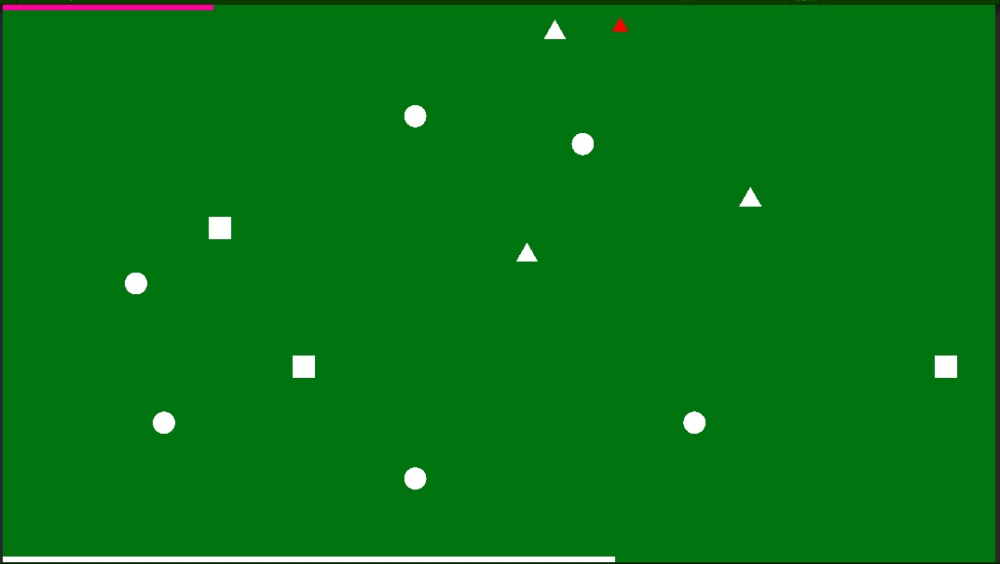

ゲーム制作技術総合実習 個人ワーク
（Circle, Triangle, Squareを使用した2Dゲーム）

# BlinkTriple

## ゲームの内容
基本的にはプレイヤーが敵から逃げながらコインを集めるゲームです。
このゲームの特色として、1ステージごとに丸、四角、三角が持っている役割がランダムに割り振られます。
何の役割が割り振られるかは始めるまでわからないので、どの形がどの役割を持っているかを瞬時に判断することになります。
また、プレイヤーを含む全ての役割を持った形が1つとは限らないので、頭がこんがらがらないようにしましょう。
(例:プレイヤーの役割を持った形が2つあるときに左へ動かすと2つとも動きます)

全ての役割は、重なることができます。「プレイヤーが重なったときを除いて」効果が重なった数の分、倍になります。

役割:プレイヤー
唯一自分で動かすことができる。コインを集めて敵を避けるように動かしてスコアを稼ぐ役割。

役割:敵
1番近いプレイヤーの役割を持った形に近づいていきます。当たらないようにしましょう。

役割:コイン
プレイヤーと重なるとスコアを獲得できます。詳しい点数はこの後！

状況に応じて獲得できるスコアは変化します
重なっていないプレイヤーがコインを取る:5点
重なっているプレイヤーがコインを取る:1点×重なっている数
プレイヤーが敵にぶつかる:点数が半分(切り捨て)に...!(わざと敵に当たりに行ってそのあとコインを集めるのを防ぐため)

レベルを自由に変えることができ、レベルに応じて数が自動的に増えていくというものを組んでいますが、
今回はBGMの長さに合わせて11ステージに設定してあります。

BGMが終わり画面全体が水色になったらゲームエンドです。

:それ以外の形:
下の白い線:いまいるステージの残り時間です。左に行ききったら強制的に次のステージに移ります。
上の赤紫の線:現在のスコアです。
上の赤い矢印:プレイ中のPCにおける最高スコアです。

折角なので、スコアなども含め本当に丸と三角と四角のみで作っています！(上下のバーもUIではなく、まさかの四角オブジェクトです)

## 操作説明
例
- WASDキーで「プレイヤー」を上下左右に移動(1回ごとに1マス動くので連打前提です！)
